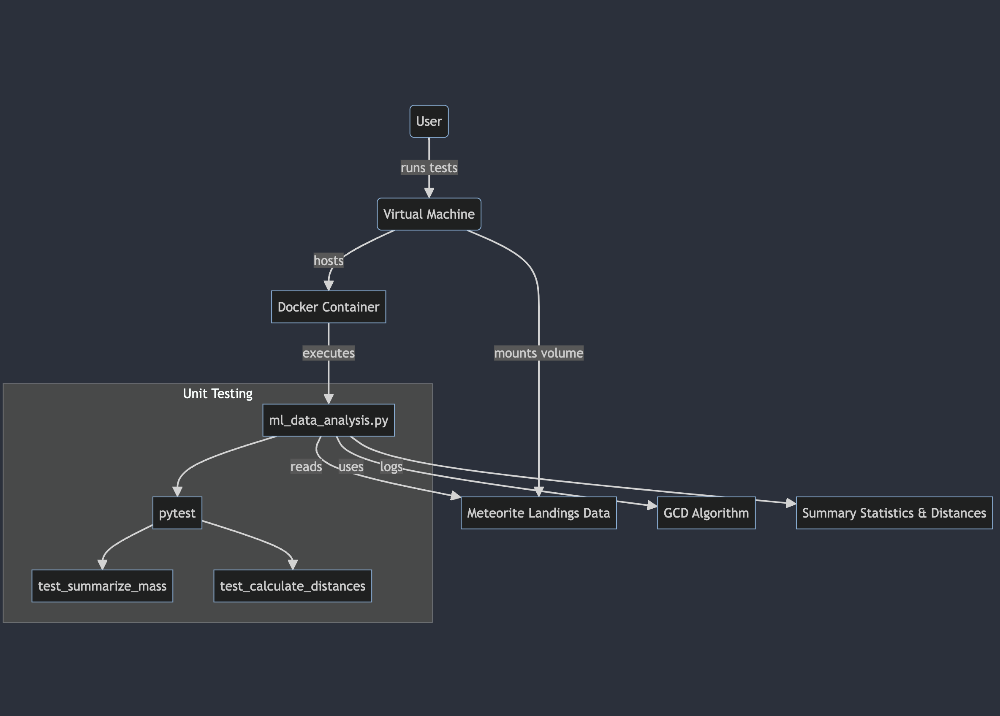

# Meteorite Landings Analysis in Docker

## Overview

This repository houses a Python-based project for analyzing meteorite landing data. It aims to parse meteorite landings data from a CSV file, compute summary statistics, identify the furthest pair of landing sites, and analyze the distribution of meteorite landings. This Dockerized setup simplifies environment setup, ensuring consistency across different machines and platforms.

## Contents

- `Dockerfile`: Instructions for building the Docker image for running the analysis.
- `ml_data_analysis.py`: Main script for reading CSV data, computing summary statistics, and finding the furthest pair of meteorite landing sites.
- `gcd_algorithm.py`: Contains the great-circle distance function for calculating distances between landing sites.
- `test_ml_data_analysis.py` and `test_gcd_algorithm.py`: Unit tests for validating functionality and accuracy.
- `README.md`: This file, explaining project setup, execution, and result interpretation.

## Data Acquisition

The Meteorite Landings dataset is used for this analysis, available from [NASA's open data portal](https://data.nasa.gov/Space-Science/Meteorite-Landings/gh4g-9sfh). Download the dataset and save it as `meteorite_landings.csv`.

## Building the Docker Image

1. Clone this repository and navigate to the project directory.
2. Build the Docker image with the following command:

```bash
docker build -t meteorite_analysis .
```

## Running the Containerized Code

To run the analysis with the downloaded data, mount the data as a volume inside the container at runtime:

```bash
docker run -v /path/to/data_directory:/data meteorite_analysis
```

Replace /path/to/data_directory with the actual path to the directory containing meteorite_landings.csv.

## Running Containerized Unit Tests
To run the unit tests inside the container, override the default command:

```bash
docker run -v /path/to/data_directory:/data meteorite_analysis pytest
```

## Software Diagram
Below is a software diagram illustrating the components of this project, including the user interaction, Docker container, scripts, unit tests, and data flow.



This diagram shows the workflow from data acquisition to analysis, highlighting the Docker container's role in encapsulating the environment and dependencies.


