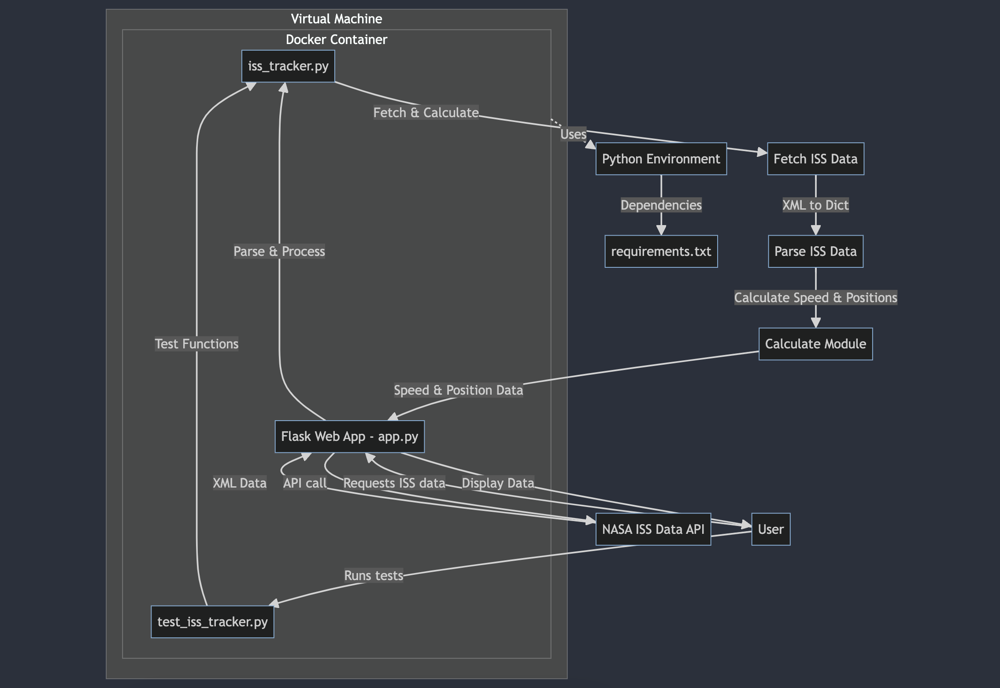

# ISS Trajectory Tracker

## Overview

This project aims to provide a tool for querying and visualizing the International Space Station (ISS) trajectory data over a 15-day period. It is designed to ingest ISS state vector data, calculate and display various metrics such as average speed, and find the position and velocity of the ISS closest to the current time. This tool is important for educational purposes, allowing users to understand and interact with space data in a meaningful way.

## Folder Contents / Project Objective

- `Dockerfile`: Configuration for containerizing the application.
- `iss_tracker.py`: Python script to fetch, process, and display ISS trajectory data.
- `test_iss_tracker.py`: Unit tests for various components of the `iss_tracker.py` script.
- `app.py`: Flask app controlling the backend aspects.
- `requirements.txt`: Module imports for Python in Docker.
- `docker-compose.yml`: File that runs the commands to build the localhost server/
- `README.md`: Documentation explaining the project, its setup, and usage.

The project simplifies the process of accessing and analyzing ISS trajectory data, making space data more accessible to the public.

## Accessing the Data Set

The ISS trajectory data is publicly available from the NASA public data portal. This data includes state vectors (position and velocity in Cartesian coordinates) of the ISS over a 15-day period, updated regularly. The data is provided in XML format, which our script processes to extract relevant information.

## Building the Container

To containerize the ISS Tracker application, ensure Docker is installed on your system, then run the following command in the project's root directory:

```bash
docker build -t iss-tracker .
```

This command builds a Docker image named `iss-tracker` based on the instructions in the Dockerfile.

## Deploying as a Flask App

To deploy your containerized code as a Flask app, use the provided `docker-compose.yml` file which simplifies the setup of your Flask application within a Docker container. Ensure Docker Compose is installed and run the following command:

```bash
docker-compose up
```

This will build the image (if not already built) and start the Flask app, exposing it on port 3000.

## Interacting with the App

### Accessing Routes

You can interact with the app using `curl` commands. Here are specific examples for each route:

- Fetch all epochs:

  ```bash
  curl http://localhost:3000/epochs
  ```

- Fetch a specific epoch:

  ```bash
  curl http://localhost:3000/epochs/<epoch>
  ```

- Get the speed for a specific epoch:

  ```bash
  curl http://localhost:3000/epochs/<epoch>/speed
  ```

- Get state vectors and speed for the epoch closest to the current time:

  ```bash
  curl http://localhost:3000/now
  ```

### Understanding the Output

- `/epochs` route returns a list of all or a subset of epochs based on query parameters.
- `/epochs/<epoch>` returns the state vector for a specific epoch.
- `/epochs/<epoch>/speed` calculates and returns the instantaneous speed for a specific epoch.
- `/now` returns state vectors and instantaneous speed for the Epoch closest to the current time.

## Running Unit Tests

To run unit tests within the container, you can override the default command with the pytest command. Assuming your tests are in `test_iss_tracker.py`, run:

```bash
docker run charan427/iss-tracker:1.0 pytest test_iss_tracker.py
```

## Software Diagram
Below is a software diagram illustrating the components of this project, including the user interaction, Docker container, scripts, unit tests, and data flow.



This diagram shows the workflow from data acquisition to analysis, highlighting the Docker container's role in encapsulating the environment and dependencies.
